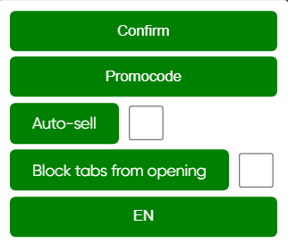

# Freeru Companion
## English description
This script adds useful features to freeru site. Allows you to complete tasks quickly.

The script does not complete subscriptions/reposts/likes on social networks, but such tasks can be completed automatically if they have no verification or if you have completed the same task before and have not cancelled the action.

The script bar looks like this:

Video illustration of the script bar:

[Changelog](CHANGELOG.md)

Write problems found while working with the script to [Issues](https://github.com/MAX1MDEV/FreeruCompanion/issues).

**Disclaimer: the usage of this script may violate the Terms of Service of the site it runs on. Use at your own risk.**

### Supported site
| Site               | Features
| :----------------- | :-----------------
| [freeru.lol](https://freeru.lol/)         | Automatic job confirmation, automatic sale, automatic opening of cases, automatic insertion and activation of promo code, automatic receipt of key on the giveaway page

### Installation
1. Install one of the browser extensions to run user scripts.  
   Tampermonkey: [Chrome](https://chrome.google.com/webstore/detail/tampermonkey/dhdgffkkebhmkfjojejmpbldmpobfkfo), [Firefox](https://addons.mozilla.org/en-US/firefox/addon/tampermonkey/), [Opera](https://addons.opera.com/en/extensions/details/tampermonkey-beta/), [Edge](https://microsoftedge.microsoft.com/addons/detail/tampermonkey/iikmkjmpaadaobahmlepeloendndfphd)  
   Violentmonkey: [Chrome](https://chrome.google.com/webstore/detail/violentmonkey/jinjaccalgkegednnccohejagnlnfdag), [Firefox](https://addons.mozilla.org/en-US/firefox/addon/violentmonkey/), [Maxthon](https://extension.maxthon.com/detail/index.php?view_id=1680), [Edge](https://microsoftedge.microsoft.com/addons/detail/violentmonkey/eeagobfjdenkkddmbclomhiblgggliao)  
2. Go [here](/../../raw/main/FreeruCompanion.user.js).
3. Confirm installation of the script.

Automatic updating of the script may require your confirmation.

### Extension
1. Download zip Release in [Releases](https://github.com/MAX1MDEV/FreeruCompanion/releases).
2. Enable developer mode in browser extensions.
3. Install the zip package by moving it to the browser window.

***

## Русское описание
Данный скрипт добавляет полезные функции на сайте с раздачами игр. Позволяет быстро выполнять задания.

Скрипт не выполняет подписки/репосты/лайки в социальных сетях, но подобные задания могут быть выполнены автоматически, если они не имеют проверки или если вы раньше уже выполняли такое же задание и не отменили действие.

Панель скрипта выглядит так:

Видеоиллюстрация панели скрипта:

[Список изменений](CHANGELOG.md)

Проблемы, найденные при работе со скриптом пишите в [Issues](https://github.com/MAX1MDEV/FreeruCompanion/issues).

**Отказ от ответственности: использование данного скрипта может нарушать правила сайта, на котором он используется. Используйте на свой страх и риск.**

### Поддерживаемые сайты
| Сайт               | Функции
| :----------------- | :-----------------
| [freeru.lol](https://freeru.lol/)         | Автоматическое подтверждение заданий, автоматическая продажа, автоматическое открытие кейсов, автоматическая вставка и активация промокода, автоматическое получение ключа на странице раздачи

### Установка
1. Установить одно из браузерных расширений для выполнения пользовательских скриптов.  
   Tampermonkey: [Chrome](https://chrome.google.com/webstore/detail/tampermonkey/dhdgffkkebhmkfjojejmpbldmpobfkfo?hl=ru), [Firefox](https://addons.mozilla.org/ru/firefox/addon/tampermonkey/), [Opera](https://addons.opera.com/ru/extensions/details/tampermonkey-beta/), [Edge](https://microsoftedge.microsoft.com/addons/detail/tampermonkey/iikmkjmpaadaobahmlepeloendndfphd?hl=ru-RU)  
   Violentmonkey: [Chrome](https://chrome.google.com/webstore/detail/violentmonkey/jinjaccalgkegednnccohejagnlnfdag?hl=ru), [Firefox](https://addons.mozilla.org/ru/firefox/addon/violentmonkey/), [Maxthon](https://extension.maxthon.com/detail/index.php?view_id=1680), [Edge](https://microsoftedge.microsoft.com/addons/detail/violentmonkey/eeagobfjdenkkddmbclomhiblgggliao?hl=ru-RU)   
2. Перейти [сюда](/../../raw/main/FreeruCompanion.user.js).
3. Подтвердить установку скрипта.

При автоматическом обновлении скрипта может потребоваться ваше подтверждение.

### Расширение
1. Скачайте последний zip релиз в [Releases](https://github.com/MAX1MDEV/FreeruCompanion/releases).
2. Включите режим разработчика в расширениях браузера.
3. Установите zip-пакет, переместив его в окно браузера.
